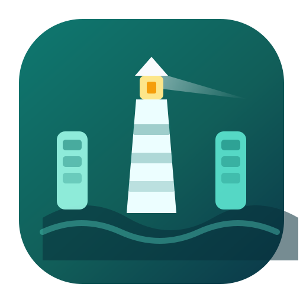

<p align="center">
  
</p>

<h1 align="center">Harbor</h1>

<p align="center">
  Local-first Kanban board with an MCP server for any compatible client.<br />
  Run the full stack on your machine — UI, API, Postgres, and agent tools.
</p>

<p align="center">
  <a href="#quick-start">Quick start</a> ·
  <a href="#what-you-can-do">Features</a> ·
  <a href="#mcp">MCP</a> ·
  <a href="#development">Development</a>
</p>

---

## What is Harbor?

Harbor is a **single-operator Kanban** that stays on localhost. Use the web UI to manage projects and issues, or drive the same board from any MCP client (Claude, Cursor, and others) through a stdio MCP server that talks to the Nest API.

```
MCP client ──stdio──► Harbor MCP ──HTTP Bearer──► Nest API ──► Postgres
Browser ─────────────────────────► Harbor UI ──/api──► Nest API
```

| Package | Path | Role |
|---------|------|------|
| `@kanban/api` | `apps/api` | NestJS + Prisma + OpenAPI |
| `@kanban/web` | `apps/web` | Harbor UI (Vite + React) |
| `@kanban/mcp` | `apps/mcp` | Stdio MCP server |

---

## What you can do

- **Projects & boards** — multiple projects, Columns and List layouts, column colors, reorder, done columns
- **Issues** — create, edit, move, archive/restore, delete; priority, type, due date, effort (hours / LOC)
- **Dependencies** — issue links (`blocks`, `relates_to`, `duplicates`) with cycle checks; blocker summaries via MCP
- **Labels, comments, activity** — label attach/detach, threaded comments, activity history
- **Attachments** — multipart file upload in the issue drawer (UI/API; max 20 MB)
- **Live updates** — board refreshes over SSE when the API or an MCP agent changes data
- **Global search** — `Ctrl/Cmd+K` across projects
- **MCP tools** — projects, columns, issues, links, blockers, epics, labels, comments, activity
- **Auth** — first-run admin signup, cookie sessions for the UI, Bearer MCP tokens from Harbor

---

## Quick start

**Requirements:** [Bun](https://bun.sh) 1.3+, Docker

```bash
git clone git@github.com:Eidantz/Harbor.git
cd Harbor
bun install
bun run setup:env       # copies .env.example → .env and links apps/api/.env
bun run docker:up       # builds & starts db + api + web
```

| Service | URL |
|---------|-----|
| Harbor UI | http://localhost:3000 |
| API health | http://localhost:3001/health |
| OpenAPI | http://localhost:3001/api/docs |

On a fresh database, open the UI and **create the admin account**. After that, the same screen is sign-in. Seed data includes sample project **KAN**.

Stop the stack with `bun run docker:down`.

---

## MCP

Harbor exposes a **stdio MCP server** any compatible client can launch (Claude Desktop / Claude Code, Cursor, and others).

1. Start Harbor (`bun run docker:up`) and complete admin signup.
2. In the UI: **MCP tokens** → **Create token** (copy it once).
3. Build the server:

```bash
bun run build:mcp
```

4. Point your client at the server with the same command + env:

```json
{
  "mcpServers": {
    "harbor": {
      "command": "node",
      "args": ["/absolute/path/to/Harbor/apps/mcp/dist/index.js"],
      "env": {
        "KANBAN_API_URL": "http://localhost:3001",
        "KANBAN_API_TOKEN": "<paste token from Harbor>"
      }
    }
  }
}
```

| Client | Where to put the config |
|--------|-------------------------|
| **Claude Desktop** | Claude → Settings → Developer → Edit Config (`claude_desktop_config.json`) |
| **Claude Code** | Project or user `.mcp.json` (same `mcpServers` shape) |
| **Cursor** | Copy [`docs/mcp.example.json`](docs/mcp.example.json) → `.cursor/mcp.json` |

Use an absolute path to `apps/mcp/dist/index.js` when the client does not start in the repo root. Reload MCP after changing config.

Full tool catalog: [`apps/mcp/README.md`](apps/mcp/README.md).

---

## Development

Keep Postgres in Docker; run API and web on the host:

```bash
bun run setup:env
docker compose up -d db
bun run db:migrate:deploy
bun run db:seed
bun run dev              # API :3001 + web :3000
```

Useful scripts: `bun run dev:api`, `bun run dev:web`, `bun run db:studio`, `bun run smoke`.

---

## Auth & privacy

| Client | Mechanism |
|--------|-----------|
| Harbor UI | First-run signup, then login → HTTP-only session cookie |
| MCP / scripts | `Authorization: Bearer <token>` from **MCP tokens** |

- Compose publishes ports on `127.0.0.1` only.
- Real secrets live in `.env` and local MCP config files (e.g. `.cursor/`) — gitignored. Use `.env.example` and [`docs/mcp.example.json`](docs/mcp.example.json) as templates.
- Rotate `SESSION_SECRET` and revoke MCP tokens for anything beyond casual local use.

---

## License

[MIT](LICENSE)
